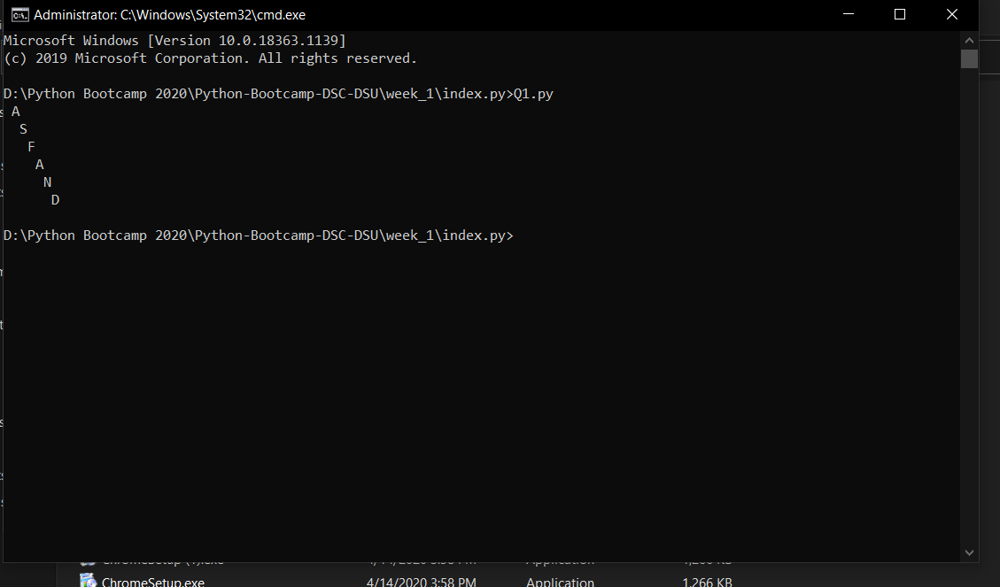
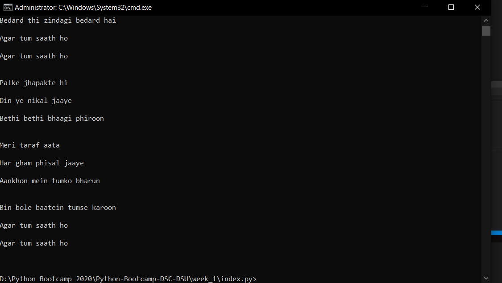

# DSC-DSU | Python Bootcamp 2020 | Week 1

Paste questions and brief writeup here
<h1>
 Question 01 
</h1>

Here we used for loop the to print the forward and reversed strings

 

<h1>
 Question 03 
</h1>

Here we print lyrics of the song using time library and split() method

 
